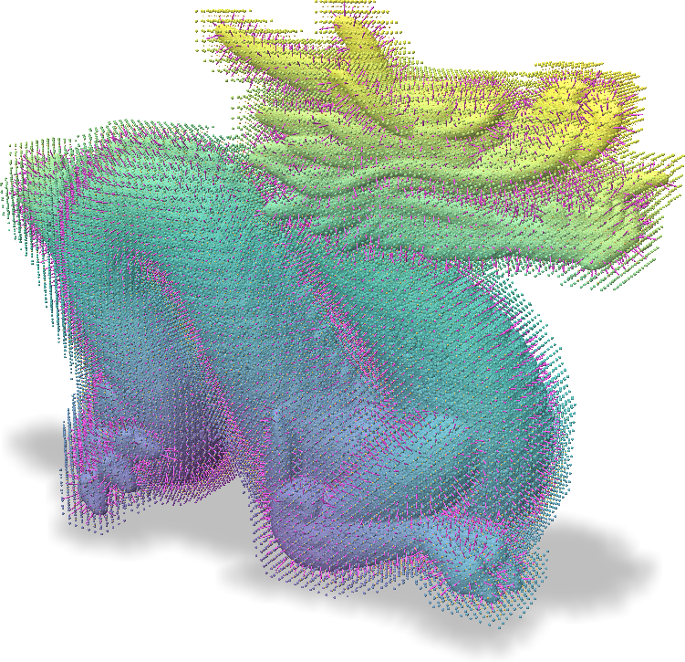
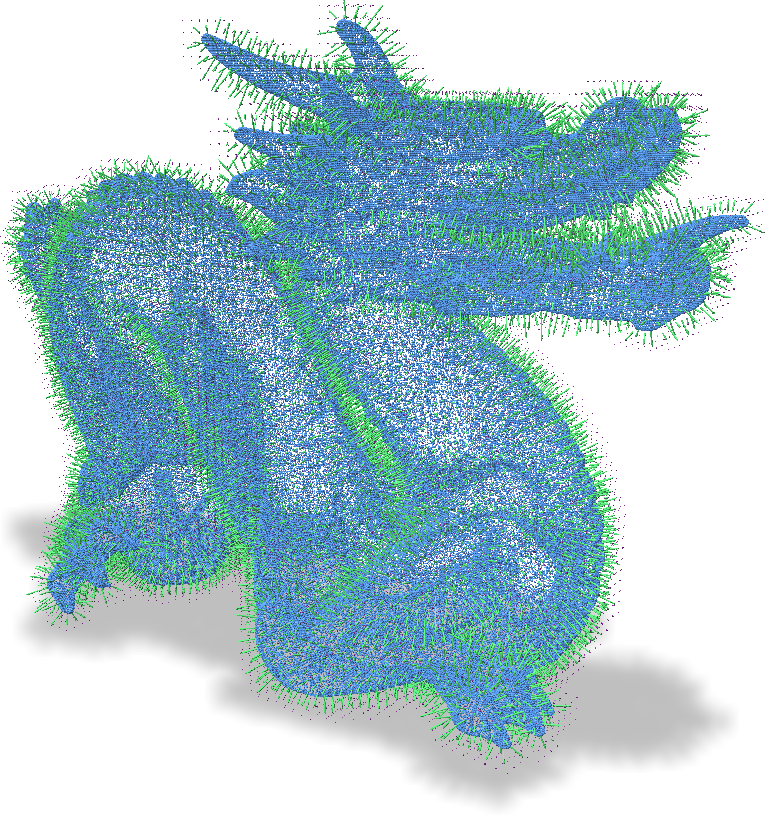
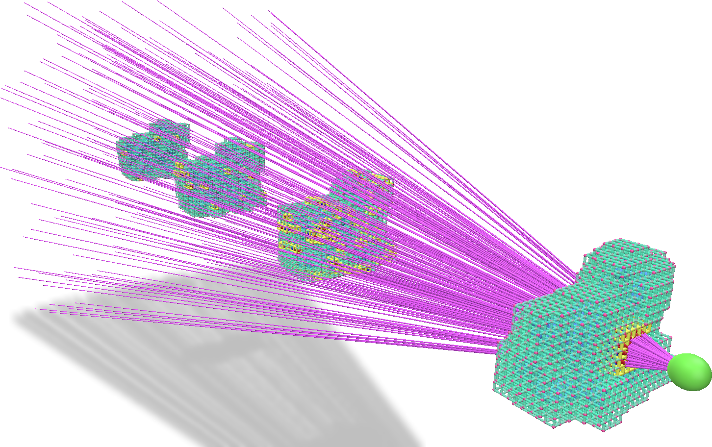
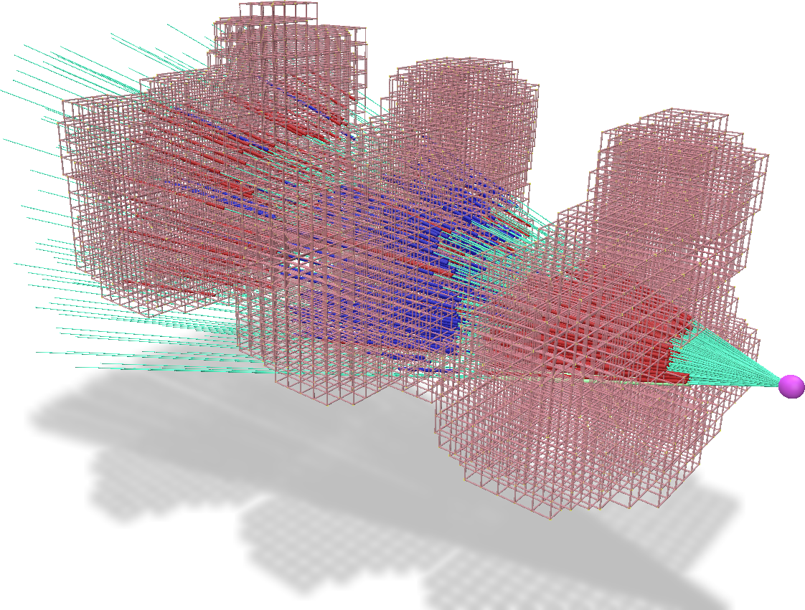
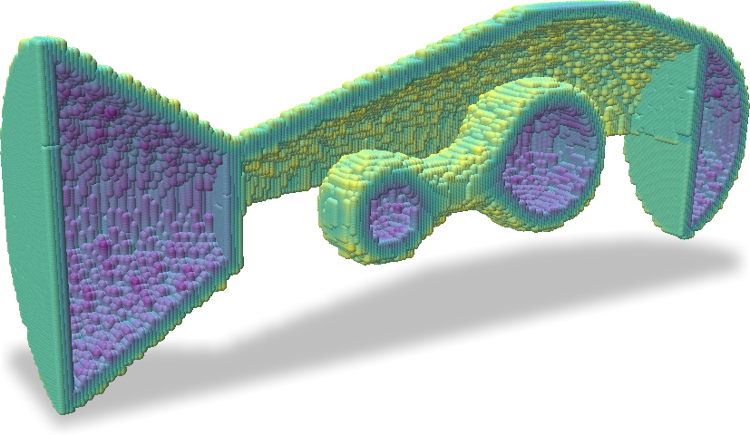

# *ƒ*(VDB)


This repository contains the code for *f*VDB, a framework for encoding and operating on *sparse voxel hierarchies* of features in PyTorch. A sparse voxel hierarchy is a coarse-to-fine hierarchy of sparse voxel grids such that every fine voxel is contained within some coarse voxel. The image below illustrates an example. *f*VDB supports using PyTorch Tensors to represent features at the corners and centers of voxels in a hierarchy and enables a number of differentiable operations on these Tensors (*e.g.* trilinear interpolation, convolution, splatting, ray tracing).

<p align="center">
  
  <!--  -->
  <figcaption style="text-align: center; font-style: italic;">An example of a sparse voxel hierarchy with 3 levels. Each fine voxel is contained within exactly one coarse voxel.</figcaption>
</p>

*f*VDB was first developed by the [NVIDIA High-Fidelity Physics Research Group](https://research.nvidia.com/labs/prl/) (a part of the NVIDIA Spatial Intelligence Lab) and continues to be developed with the OpenVDB community to suit the growing needs for a robust framework for spatial intelligence research and applications.  Please review [the paper](https://research.nvidia.com/labs/prl/publication/williams2024fvdb/) for more details and kindly consider [citing it in your work](#references) if you find it useful.

## Learning to Use *f*VDB

After [installing *f*VDB](#installing-fvdb), we recommend starting with our walk-through [notebooks](notebooks) which provide a gentle, illustrated introduction to the main concepts and operations in *f*VDB.

Once familiar with the basics, [Usage Examples](#usage-examples) introduces a few of the practical python scripts that can be further explored in the [examples](examples) directory.

Lastly, our [documentation](docs) provides deeper details on the concepts as well as an exhaustive set of illustrations of all the operations available in *f*VDB and an API reference. The [documentation can be built locally](#building-documentation) or can be accessed online at https://www.openvdb.org/documentation/fvdb/.

## Installing *f*VDB

During the project's initial development stages, it is necessary to [run the build steps](#building-fvdb-from-source) to install ƒVDB. Eventually, ƒVDB will be provided as a pre-built, installable package. We support building the latest ƒVDB version for the following library configurations:

|   PyTorch      | Python      | CUDA |
| -------------- | ----------- | ------------ |
|  2.8.0-2.9.0   | 3.10 - 3.12 | 12.8 - 13.0 |


** Notes:**
* Linux is the only platform currently supported (Ubuntu >= 22.04 recommended).
* A CUDA-capable GPU with Ampere architecture or newer (i.e. compute capability >=8.0) is recommended to run the CUDA-accelerated operations in ƒVDB.  A GPU with compute capabililty >=7.0 (Volta architecture) is the minimum requirement but some operations and data types are not supported.


## Building *f*VDB from Source

### Environment Management
ƒVDB is a Python library implemented as a C++ PyTorch extension.  Of course you can build ƒVDB in whatever environment suits you, but we provide three distinct paths to constructing reliable environments for building and running ƒVDB. These are separate options and are not intended to be used together.

1. **RECOMMENDED** [conda](#option-1-conda-environment-recommended)
2. Using [Docker](#option-2-docker-container)
3. [Python virtual environment](#option-3-python-virtual-environment)

`conda` tends to be more flexible since reconfiguring toolchains and modules to suit your larger project can be dynamic, but at the same time this can be a more brittle experience compared to using a virtualized `docker` container.  Using `conda` is generally recommended for development and testing, while using `docker` is recommended for CI/CD and deployment.

---


#### **OPTION 1** Conda Environment (Recommended)

*f*VDB can be used with any Conda distribution installed on your system. Below is an installation guide using
[miniforge](https://github.com/conda-forge/miniforge). You can skip steps 1-3 if you already have a Conda installation.

1. Download and Run Install Script. Copy the command below to download and run the [miniforge install script](https://github.com/conda-forge/miniforge?tab=readme-ov-file#unix-like-platforms-macos--linux):

```shell
curl -L -O "https://github.com/conda-forge/miniforge/releases/latest/download/Miniforge3-$(uname)-$(uname -m).sh"
bash Miniforge3-$(uname)-$(uname -m).sh
```

2. Follow the prompts to customize Conda and run the install. Note, we recommend saying yes to enable `conda-init`.

3. Start Conda. Open a new terminal window, which should now show Conda initialized to the `(base)` environment.

4. Create the `fvdb` conda environment. Run the following command from the directory containing this README:

```shell
conda env create -f env/dev_environment.yml
```

5. Activate the *f*VDB environment:

```shell
conda activate fvdb
```

##### Other available environments
* `fvdb_build`: Use `env/build_environment.yml` for a minimum set of dependencies needed just to build/package *f*VDB (note this environment won't have all the runtime dependencies needed to `import fvdb`).
* `fvdb_test`: Use `env/test_environment.yml` for a runtime environment which has only the packages required to run the unit tests after building ƒVDB. This is the environment used by the CI pipeline to run the tests after building ƒVDB in the `fvdb_build` environment.
* `fvdb_learn`: Use `env/learn_environment.yml` for additional runtime requirements and packages needed to run the [notebooks](notebooks) or [examples](examples) and view their visualizations.

---

#### **OPTION 2** Docker Container

Running a Docker container ensures that you have a consistent environment for building and running ƒVDB. Start by installing Docker and the [NVIDIA Container Toolkit](https://docs.nvidia.com/datacenter/cloud-native/container-toolkit/latest/install-guide.html).

Our provided [`Dockerfile`](Dockerfile) constructs a container that pre-installs the dependencies needed to build and run ƒVDB.

In the fvdb-core directory, build the Docker image:
```shell
docker build -t fvdb-devel .
```

When you are ready to build ƒVDB, run the following command within the docker container.  `TORCH_CUDA_ARCH_LIST` specifies which CUDA architectures to build for.
```shell
docker run -it --mount type=bind,src="$(pwd)",target=/workspace fvdb-devel bash
cd /workspace;
pip install -r env/build_requirements.txt
TORCH_CUDA_ARCH_LIST="7.5;8.0;8.6+PTX" \
./build.sh install -v
```

In order to extract an artifact from the container such as the Python wheel, query the container ID using `docker ps` and copy the artifact using `docker cp`.

---

#### **OPTION 3** Python Virtual Environment

Using a Python virtual environment enables you to use your system provided compiler and CUDA toolkit. This can be especially useful if you are using ƒVDB in conjunction with other Python packages, especially ones that have been build from source. Start by installing GCC, the CUDA Toolkit, and cuDNN.

Then, create a Python virtual environment, install the requisite dependencies, and build:

```shell
python -m venv fvdb
source fvdb/bin/activate
pip install -r env/build_requirements.txt
TORCH_CUDA_ARCH_LIST="7.5;8.0;8.6+PTX" ./build.sh install -v
```

---

### Building *f*VDB

**:warning: Note:** Compilation can be very memory-consuming. As part of our build script, we set the `CMAKE_BUILD_PARALLEL_LEVEL` environment variable to control compilation job parallelism with a value that we find works well for most machines (allowing for one job every 2.5GB of memory) but this can be overridden by setting the `CMAKE_BUILD_PARALLEL_LEVEL` environment variable to a different value.

** Note:** To save time and trouble on repeated clean builds, configure your `CPM_SOURCE_CACHE`. Add the following to your shell configuration (e.g. `.bashrc`)

```shell
export CPM_SOURCE_CACHE=$HOME/.cache/CPM
```

If this is not set, CMake Package Manager (CPM) will cache in the fVDB build directory. Keeping the cache outside of the build directory allows build-time dependencies
to be reused across fvdb clean-build cycles and saves build time. [See the CPM documentation for more detail](https://github.com/cpm-cmake/CPM.cmake?tab=readme-ov-file#cpm_source_cache)

You can either perform an install:
```shell
./build.sh
```

or if you would like to build a packaged wheel for installing in other environments, you can run the following command:
```shell
./build.sh wheel
```


### Running Tests

To make sure that everything works by running tests:
```shell
cd tests
pytest unit
```

### Building Documentation

To build the documentation, simply run:
```shell
python setup.py build_ext --inplace
sphinx-build -E -a docs/ build/sphinx
# View the docs
open build/sphinx/index.html
```

### Setting up Intellisense with clangd in Visual Studio Code

Please see the guide [`Clangd for Intellisense in fVDB`](docs/markdown/clangd.md)


## Usage Examples
The [examples](examples) directory contains a number of useful illustrations using the `fvdb` Python package. The sections below show some notable examples and their outputs. Run all commands from the directory containing this README.

### Trilinear sampling of grids
```
python examples/sample_trilinear.py
```
This script generates a grid with scalars at the corners of each voxel and samples this grid at points. The visualization below shows the points colored according to their sampled values as well as the values at grid corners.
<p align="center">
  
  <figcaption style="text-align: center; font-style: italic;">Trilinearly interpolate the corner values at the points.</figcaption>
</p>


### Trilinear splatting into grids
```
python examples/splat_trilinear.py
```
This script splats normals of a point cloud onto grid centers. The green arrows represent the values of the normals splatted onto each grid center
<p align="center">
  
  <figcaption style="text-align: center; font-style: italic;">Splat the normals at the blue points into the center of each grid cell. The green arrows are the splatted normals</figcaption>
</p>


### Tracing voxels along rays (hierarchical DDA)
```
python examples/ray_voxel_marching.py
```
This script demonstrates finding the first `N` voxels which lie along a ray (returning thier index as well as their entry and exit points).
<p align="center">
  
  <figcaption style="text-align: center; font-style: italic;">Find the voxels (yellow) which intersect the pink rays eminating from the green dot.</figcaption>
</p>


### Tracing contiguous segments along rays
```
python examples/ray_segment_marching.py
```
This script demonstrates finding the first `N` continuous segments of voxels which lie along a ray (returning thier index as well as their entry and exit points).
<p align="center">
  
  <figcaption style="text-align: center; font-style: italic;">Find the contiguous segments of voxels (red and blue lines) which intersect the cyan rays eminating from the pink dot.</figcaption>
</p>


### Backpropagating through sampling and splatting
```
python examples/overfit_sdf.py
```
This scripts fits SDF values at a grid corner to the SDF of a mesh using gradient descent.
<p align="center">
  
  <figcaption style="text-align: center; font-style: italic;">SDF values at grid corners (colored dots) fitted using gradient descent to the SDF of a mesh.</figcaption>
</p>

The following scripts also show how to bakcprop through splatting and sampling with fVDB:
```
python scripts/debug_grad_trilerp.py
```
```
python scripts/debug_grad_splat.py
```

## Code Structure
The main source code for fVDB lives in the [src](src) directory. There are several important files here:
* `src/python/Bindings.cpp` exposes functionality directly to Python. It is mainly a wrapper around the core classes such as `fvdb::GridBatch` and `fvdb::JaggedTensor`.
* `src/GridBatch.h` contains the implementation of `fvdb::GridBatch` which is the core data structure on which fVDB is built. A `GridBatch` acts as a map between `(i, j, k)` integer coordinates and offsets in linear memory. This mapping can be used to perform a host of operations. The methods in this class are mostly lightweight wrappers around a set of CPU and CUDA *kernels*. The function prototypes for these kernels are defined in `src/detail/ops/Ops.h`.
* `src/detail/ops/Ops.h` contains the function prototypes for the main kernels used by fVDB. Host and device kernel implementations are provided in the `src/detail/ops/*.cu` source files.
* `src/detail/autograd` contains C++ implementations of PyTorch autograd functions for differentiable operations.  `#include <detail/autograd/Autograd.h>` includes all of the functions in this directory.
* `src/detail/utils/nanovdb` contains a number of utilities which make it easier to use NanoVDB.


## References

Please consider citing this when using *f*VDB in a project. You can use the citation BibTeX:

```bibtex
@article{williams2024fvdb,
  author = {Williams, Francis and Huang, Jiahui and Swartz, Jonathan and Klar, Gergely and Thakkar, Vijay and Cong, Matthew and Ren, Xuanchi and Li, Ruilong and Fuji-Tsang, Clement and Fidler, Sanja and Sifakis, Eftychios and Museth, Ken},
  title = {fVDB : A Deep-Learning Framework for Sparse, Large Scale, and High Performance Spatial Intelligence},
  year = {2024},
  issue_date = {July 2024},
  publisher = {Association for Computing Machinery},
  address = {New York, NY, USA},
  volume = {43},
  number = {4},
  issn = {0730-0301},
  url = {https://doi.org/10.1145/3658226},
  doi = {10.1145/3658226},
  journal = {ACM Trans. Graph.},
  month = jul,
  articleno = {133},
  numpages = {15},
}
```

## Contact
