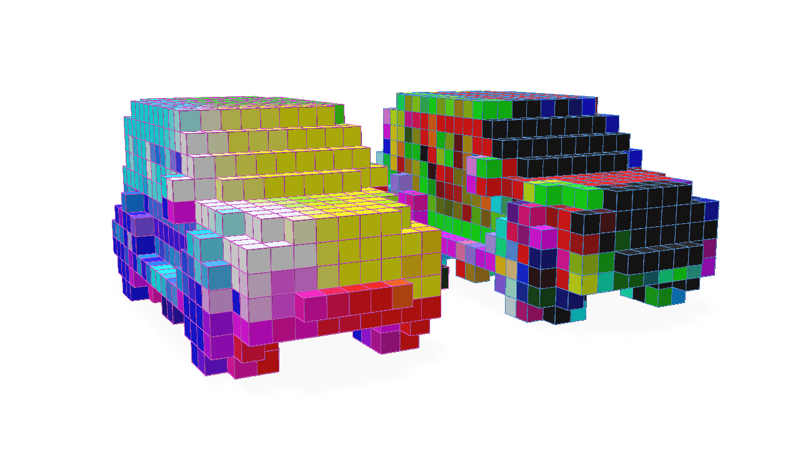
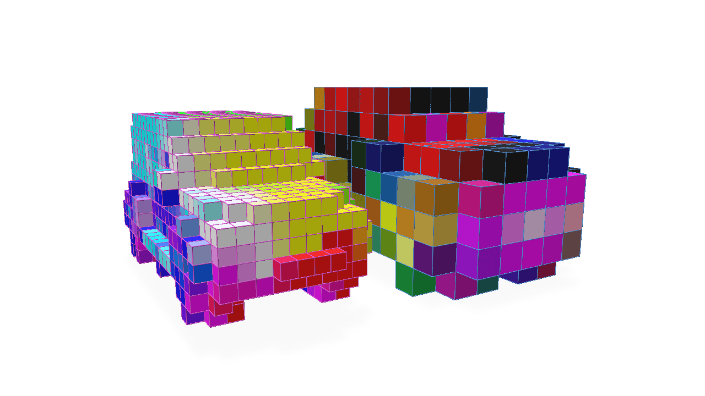
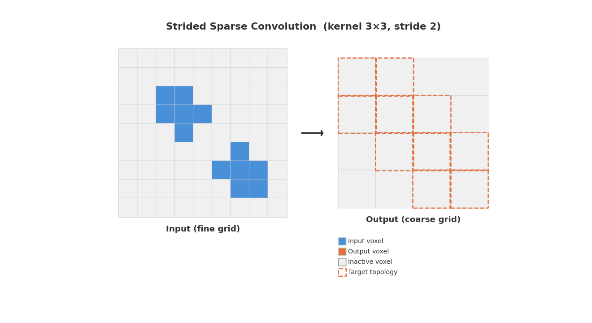
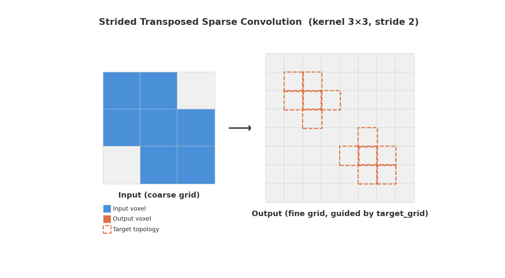
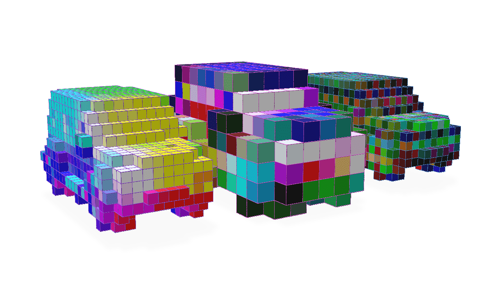
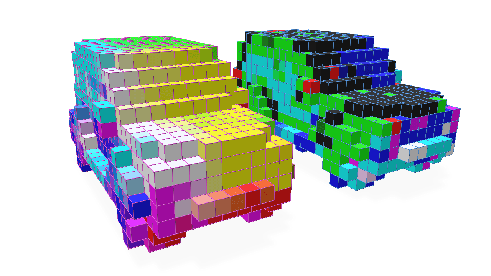

# Grid and GridBatch Convolution Operations


Convolving the features of a `GridBatch` can be accomplished with either a high-level `torch.nn.Module` derived class provided by `fvdb.nn` or with more low-level methods available with `GridBatch`, we will illustrate both techniques.

### High-level Usage with `fvdb.nn`

`fvdb.nn.SparseConv3d` provides a high-level `torch.nn.Module` class for convolution on `fvdb` classes that is an analogue to the use of `torch.nn.Conv3d`.  Using this module is the recommended functionality for performing convolution with `fvdb` because it not only manages functionality such as initializing the weights of the convolution and calling appropriate backend implementation functions but it also provides certain backend optimizations which will be illustrated in the [Low-level usage](#low-level-usage-with-gridbatch) section.

`fvdb.nn.SparseConv3d` takes explicit `(data: JaggedTensor, plan: ConvolutionPlan)` arguments — topology and features are always passed separately.  A `ConvolutionPlan` precomputes the necessary acceleration structures for a given grid and kernel configuration.

A simple example of using `fvdb.nn.SparseConv3d` is as follows:

```python
import fvdb
import fvdb.nn as fvdbnn
from fvdb import ConvolutionPlan
from fvdb.utils.examples import load_car_1_mesh
import torch
import numpy as np
import point_cloud_utils as pcu

num_pts = 10_000
vox_size = 0.02

mesh_load_funcs = [load_car_1_mesh]

points = []
normals = []

for func in mesh_load_funcs:
    pts, nms = func(mode="vn")
    pmt = torch.randperm(pts.shape[0])[:num_pts]
    pts, nms = pts[pmt], nms[pmt]
    points.append(pts)
    normals.append(nms)

# JaggedTensors of points and normals
points = fvdb.JaggedTensor(points)
normals = fvdb.JaggedTensor(normals)

# Create a grid
grid = fvdb.GridBatch.from_points(points, voxel_sizes=vox_size)

# Splat the normals into the grid with trilinear interpolation
vox_normals = grid.splat_trilinear(points, normals)

# Build a ConvolutionPlan for stride=1 same-topology convolution
plan = ConvolutionPlan.from_grid_batch(kernel_size=3, stride=1, source_grid=grid, target_grid=grid)

# fvdb.nn.SparseConv3d is a convenient torch.nn.Module implementing the fVDB convolution
conv = fvdbnn.SparseConv3d(in_channels=3, out_channels=3, kernel_size=3, stride=1, bias=False).to(grid.device)

output = conv(vox_normals, plan)
```
Let's visualize the original grid with normals visualized as colours alongside the result of these features after a convolution initialized with random weights:


For stride values greater than 1, the output of the convolution will be a grid with a smaller resolution than the input grid (similar in topological effect to the output of a Pooling operator).  Let's illustrate this:

```python continuation
# Stride=2: output grid has half the resolution (twice the world-space voxel size)
plan_down = ConvolutionPlan.from_grid_batch(kernel_size=3, stride=2, source_grid=grid, target_grid=None)
conv_down = fvdbnn.SparseConv3d(in_channels=3, out_channels=3, kernel_size=3, stride=2, bias=False).to(grid.device)

output = conv_down(vox_normals, plan_down)
coarse_grid = plan_down.target_grid_batch
```



The following animations illustrate how strided sparse convolution and its transpose work. In strided convolution, a kernel slides across the fine input grid with stride=2, producing a coarser output grid. In strided transposed convolution, the process is reversed — a coarse grid is upsampled back to a finer resolution:





Strided transposed convolution can be performed with `fvdb.nn.SparseConvTranspose3d` (a separate class) to increase the resolution of the grid. Because the output of a transposed convolution on a sparse grid is not uniquely determined, the plan must specify a `target_grid` using `ConvolutionPlan.from_grid_batch_transposed`. The choice of `target_grid` depends on the use case: in an encoder-decoder network (such as a U-Net), the target is typically a grid saved from the corresponding encoder layer; for other architectures, it could be any grid with the desired resolution and active voxel pattern.

```python continuation
# Strided transposed convolution operator, stride=2
transposed_conv = fvdbnn.SparseConvTranspose3d(in_channels=3, out_channels=3, kernel_size=3, stride=2, bias=False).to(grid.device)

# Build a transposed plan: source is the coarse grid, target is the original fine grid
plan_up = ConvolutionPlan.from_grid_batch_transposed(kernel_size=3, stride=2, source_grid=coarse_grid, target_grid=grid)
transposed_output = transposed_conv(output, plan_up)
```

Here we visualize the original grid, the grid after strided convolution, and the grid after strided transposed convolution. The strided transposed convolution inverts the topological operation of the strided convolution, producing the same topology as the original grid with the features convolved by our two layers:




### Low-level Usage with `GridBatch`

The [high-level `fvdb.nn.SparseConv3d` class](#high-level-convolution-with-fvdbnn) wraps several pieces of `GridBatch` functionality to provide a convenient `torch.nn.Module` for convolution.  However, for a more low-level approach that accomplishes the same outcome, the `GridBatch` class itself can be the starting point for performing convolution on the grid and its features.  We will illustrate this approach for completeness, though we do recommend the use of the `fvdb.nn.SparseConv3d` Module for most use-cases.

Using the `GridBatch` convolution functions directly requires a little more knowledge about what happens under the hood.  Due to the nature of a sparse grid, in order to make convolution performant, fVDB precomputes the necessary acceleration structures for a given sparse grid, kernel size, and stride.

The `fvdb.ConvolutionPlan` class encapsulates these acceleration structures and uses them to perform the convolution.  Here is an example of how to construct a `ConvolutionPlan` and use it to perform a convolution:

```python
import fvdb
from fvdb import ConvolutionPlan
from fvdb.utils.examples import load_car_1_mesh
import torch
import numpy as np
import point_cloud_utils as pcu

num_pts = 10_000
vox_size = 0.02

mesh_load_funcs = [load_car_1_mesh]

points = []
normals = []

for func in mesh_load_funcs:
    pts, nms = func(mode="vn")
    pmt = torch.randperm(pts.shape[0])[:num_pts]
    pts, nms = pts[pmt], nms[pmt]
    points.append(pts)
    normals.append(nms)

# JaggedTensors of points and normals
points = fvdb.JaggedTensor(points)
normals = fvdb.JaggedTensor(normals)

# Create a grid
grid = fvdb.GridBatch.from_points(points, voxel_sizes=vox_size)

# Splat the normals into the grid with trilinear interpolation
vox_normals = grid.splat_trilinear(points, normals)

# Create a convolution plan — this precomputes the acceleration structures for the given grid and kernel
plan = ConvolutionPlan.from_grid_batch(kernel_size=3, stride=1, source_grid=grid)

# Create random weights for our convolution kernel of size 3x3x3 that takes 3 input channels and produces 3 output channels
kernel_weights = torch.randn(3, 3, 3, 3, 3, device=grid.device)

# Execute the convolution
conv_vox_normals = plan.execute(vox_normals, kernel_weights)
```
Here we visualize the output of our convolution alongside the original grid with normals visualized as colours:


These acceleration structures can potentially be expensive to compute, so it is often useful to re-use the `ConvolutionPlan` in the same network to perform a convolution on other features or with different weights.  This optimization is something `fvdb.nn.SparseConv3d` attempts to do where appropriate and is one reason we recommend using `fvdb.nn.SparseConv3d` over this low-level approach.
