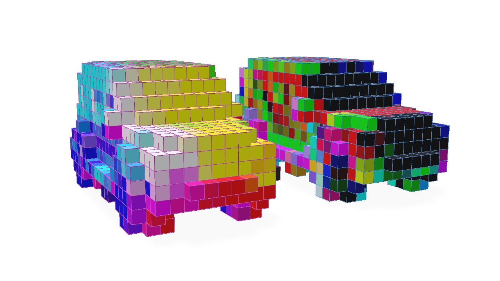
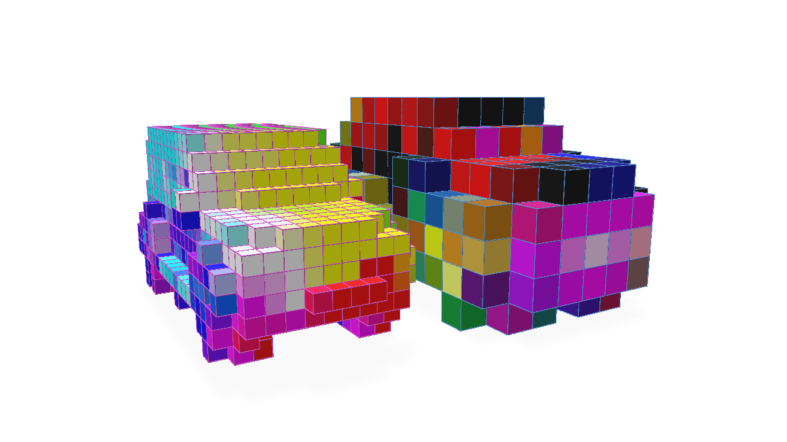
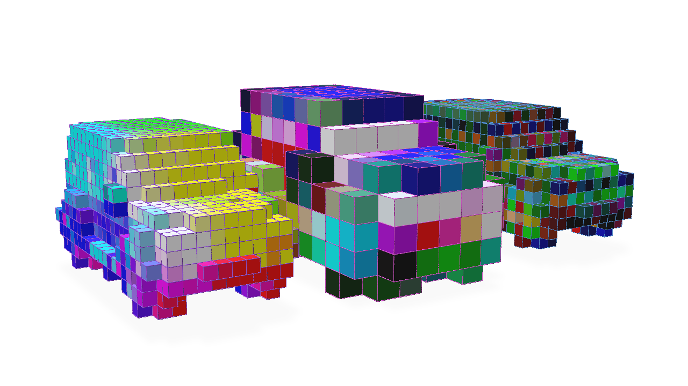

# Grid and GridBatch Convolution Operations


Convolving the features of a `GridBatch` can be accomplished with either a high-level `torch.nn.Module` derived class provided by `fvdb.nn` or with more low-level methods available with `GridBatch`, we will illustrate both techniques.

### High-level Usage with `fvdb.nn`

`fvdb.nn.SparseConv3d` provides a high-level `torch.nn.Module` class for convolution on `fvdb` classes that is an analogue to the use of `torch.nn.Conv3d`.  Using this module is the recommended functionality for performing convolution with `fvdb` because it not only manages functionality such as initializing the weights of the convolution and calling appropriate backend implementation functions but it also provides certain backend optimizations which will be illustrated in the [Low-level usage](#low-level-usage-with-gridbatch) section.

One thing to note is `fvdb.nn.SparseConv3d` operates on a class that wraps a `GridBatch` and `JaggedTensor` together into a convenience object, `fvdb.VDBTensor`, which is used by all the `fvdb.nn` modules.

A simple example of using `fvdb.nn.SparseConv3d` is as follows:

```python
import fvdb
import fvdb.nn as fvdbnn
from fvdb.utils.examples import load_car_1_mesh
import torch
import numpy as np
import point_cloud_utils as pcu

num_pts = 10_000
vox_size = 0.02

mesh_load_funcs = [load_car_1_mesh]

points = []
normals = []

for func in mesh_load_funcs:
    pts, nms = func(mode="vn")
    pmt = torch.randperm(pts.shape[0])[:num_pts]
    pts, nms = pts[pmt], nms[pmt]
    points.append(pts)
    normals.append(nms)

# JaggedTensors of points and normals
points = fvdb.JaggedTensor(points)
normals = fvdb.JaggedTensor(normals)

# Create a grid
grid = fvdb.GridBatch.from_points(points, voxel_sizes=vox_size)

# Splat the normals into the grid with trilinear interpolation
vox_normals = grid.splat_trilinear(points, normals)

# VDBTensor is a simple wrapper of a grid and a feature tensor
vdbtensor = fvdbnn.VDBTensor(grid, vox_normals)

# fvdb.nn.SparseConv3d is a convenient torch.nn.Module implementing the fVDB convolution
conv = fvdbnn.SparseConv3d(in_channels=3, out_channels=3, kernel_size=3, stride=1, bias=False).to(vdbtensor.device)

output = conv(vdbtensor)
```
Let's visualize the original grid with normals visualized as colours alongside the result of these features after a convolution initialized with random weights:


For stride values greater than 1, the output of the convolution will be a grid with a smaller resolution than the input grid (similar in topological effect to the output of a Pooling operator).  Let's illustrate this:

```python continuation
# We would expect for stride=2 that the output grid would have half the resolution (or twice the world-space size) of the input grid
conv = fvdbnn.SparseConv3d(in_channels=3, out_channels=3, kernel_size=3, stride=2, bias=False).to(vdbtensor.device)

output = conv(vdbtensor)
```




Transposed convolution can be performed with `fvdb.nn.SparseConv3d` which can increase the resolution of the grid.  It only really makes sense to perform transposed sparse convolution with a target grid topology we wish to produce with this operation (see the [Pooling Operators](#maxmean-pooling) for an explanation).  Therefore, an `out_grid` argument must be provided in this case to specify the target grid topology:

```python continuation
# Tranposed convolution operator, stride=2
transposed_conv = fvdbnn.SparseConv3d(in_channels=3, out_channels=3, kernel_size=3, stride=2, bias=False, transposed=True).to(vdbtensor.device)

# Note the use of the `out_grid` argument to specify the target grid topology
transposed_output = transposed_conv(output, out_grid=vdbtensor.grid)
```

Here we visuzlie the original grid, the grid after strided convolution and the grid after transposed convolution inverts the topological operation of the strided convolution to produce the same topology as the original grid with the features convolved by our two layers:




### Low-level Usage with `GridBatch`

The [high-level `fvdb.nn.SparseConv3d` class](#high-level-convolution-with-fvdbnn) wraps several pieces of `GridBatch` functionality to provide a convenient `torch.nn.Module` for convolution.  However, for a more low-level approach that accomplishes the same outcome, the `GridBatch` class itself can be the starting point for performing convolution on the grid and its features.  We will illustrate this approach for completeness, though we do recommend the use of the `fvdb.nn.SparseConv3d` Module for most use-cases.

Using the `GridBatch` convolution functions directly requires a little more knowledge about the implementation under-the-hood.  Due to the nature of a sparse grid, in order to make convolution performant, it is useful to pre-compute a mapping of which features in the input grid will contribute to the values of the output grid when convolved by a kernel of a particular dimension and stride.  This mapping structure is called a 'kernel map'.

The `fvdb.ConvolutionPlan` class encapsulates this kernel map and uses it to perform the convolution.  Here is an example of how to construct a `ConvolutionPlan` and use it to perform a convolution:

```python
import fvdb
from fvdb import ConvolutionPlan
from fvdb.utils.examples import load_car_1_mesh
import torch
import numpy as np
import point_cloud_utils as pcu

num_pts = 10_000
vox_size = 0.02

mesh_load_funcs = [load_car_1_mesh]

points = []
normals = []

for func in mesh_load_funcs:
    pts, nms = func(mode="vn")
    pmt = torch.randperm(pts.shape[0])[:num_pts]
    pts, nms = pts[pmt], nms[pmt]
    points.append(pts)
    normals.append(nms)

# JaggedTensors of points and normals
points = fvdb.JaggedTensor(points)
normals = fvdb.JaggedTensor(normals)

# Create a grid
grid = fvdb.GridBatch.from_points(points, voxel_sizes=vox_size)

# Splat the normals into the grid with trilinear interpolation
vox_normals = grid.splat_trilinear(points, normals)

# Create a convolution plan — this precomputes the kernel map between source and target grids
plan = ConvolutionPlan.from_grid_batch(kernel_size=3, stride=1, source_grid=grid)

# Create random weights for our convolution kernel of size 3x3x3 that takes 3 input channels and produces 3 output channels
kernel_weights = torch.randn(3, 3, 3, 3, 3, device=grid.device)

# Execute the convolution
conv_vox_normals = plan.execute(vox_normals, kernel_weights)
```
Here we visualize the output of our convolution alongside the original grid with normals visualized as colours:


The kernel map can potentially be expensive to compute, so it is often useful to re-use the `ConvolutionPlan` in the same network to perform a convolution on other features or with different weights.  This optimization is something `fvdb.nn.SparseConv3d` attempts to do where appropriate and is one reason we recommend using `fvdb.nn.SparseConv3d` over this low-level approach.
